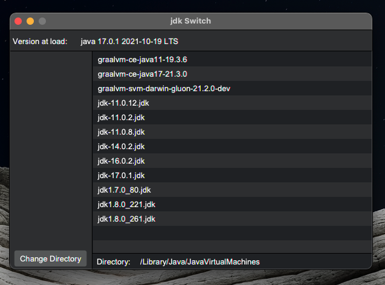

# jdkSwitch

## Info
Simple MacOS app to quickly/temporarily change macOS jdk version with terminal commands. 

## How To 
Open a terminal and jdkSwitch. Set your directory to where your jdk folders are stored. Highlighting your chosen jdk will copy the export command needed to switch to it. Paste it in the terminal and run it. (export JAVA_HOME=/path/to/jdk/Content/Home)
	
## Tech
Project is created with:
* Java Version: 11.0.11
* JavaFX Version: 17.0.1
* IDE: IntelliJ 
* Build: Maven

